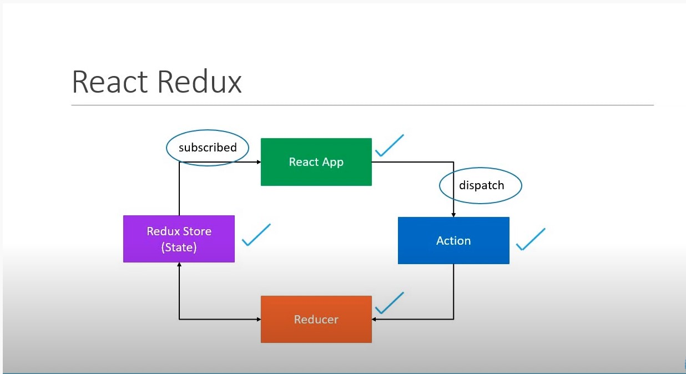

# redux-core-and-react-redux

## Objective:
Get better understanding of Redux
***
## Contains
 - redux-core : Redux core concept without React
 - redux-react : Redux core concepts applied to React
***
## Docs
| subject         |    Link                                              | 
|:----------      |:-------------                                        |
| Axios           |  https://github.com/axios/axios                      |
| Redux           |  https://redux.js.org/                               |
| Redux Logger    |  https://www.npmjs.com/package/redux-logger          |
| Redux Thunk     |  https://github.com/reduxjs/redux-thunk              |
| Dummy data      |  https://jsonplaceholder.typicode.com/               |

***
 
 
<h4> Redux diagram</h4>

